# OpenAcademy for Odoo 14

Author: `Peter Wu`


* course (課程主檔)

```python
from odoo import models, fields, api
from odoo.exceptions import UserError


class OpenAcademyCourse(models.Model):
    _name = "openacademy.course"
    _description = "開源學園-課程主檔"

    course_no = fields.Char(string="課程編號", required=True)
    course_name = fields.Char(string="課程名稱", required=True)
    course_type = fields.Selection([('1', '必修'), ('2', '選修')], string="課程型態", required=True)

    def name_get(self):
        result = []
        for record in self:
            if record.course_type == '1':
                myclass = '必修'
            elif record.course_type == '2':
                myclass = '選修'

            myname = "[%s]%s-%s" % (record.course_no, record.course_name, myclass)
            result.append((record.id, myname))
        return result
```

* teacher (導師主檔)

```python
from odoo import models, fields, api
from odoo.exceptions import UserError


class openacademyteacher(models.Model):
    _name = "openacademy.teacher"
    _description = "開源學園-教職主檔"

    teacher_no = fields.Char(string="教職編號")
    teacher_name = fields.Char(string="教員姓名")


    def name_get(self):
        result = []
        for record in self:
            myname = "[%s]%s" % (record.teacher_no, record.teacher_name)
            result.append((record.id, myname))
        return result


class openacademyclass(models.Model):
    _name = "openacademy.studentclass"
    _description = "開源學園-班級-導師主檔"

    student_class_name = fields.Char(string="班級")
    student_teacher = fields.Many2one('openacademy.teacher', string="班導")


    def name_get(self):
        result = []
        for record in self:
            myname = "[%s]%s" % (record.student_class_name, record.student_teacher.teacher_name)
            result.append((record.id, myname))
        return result
```

* student (學生主檔)

```python
from odoo import models, fields, api
from odoo.exceptions import UserError
from datetime import datetime

class openacademystudent(models.Model):
    _name = "openacademy.student"
    _description = "開源學園-學生主檔"

    student_no = fields.Char(string="學號", required=True)
    student_name = fields.Char(string="學生姓名", required=True)
    student_contact = fields.Char(string="聯絡人")
    student_class = fields.Selection([('1', '一年級'), ('2', '二年級'), ('3', '三年級')], string="年級", required=True)
    student_fm = fields.Selection([('M', '男'), ('F', '女')], string="性別", default='M')
    student_memo = fields.Text(string="備註")
    student_obj = fields.Binary(string="圖片")
    student_birthday = fields.Date(string="生日", default=datetime.now().strftime('%Y-%m-%d'))

    def name_get(self):
        result = []
        myclass=' '
        for record in self:
            if record.student_class == '1':
                myclass = '一年級'
            elif record.student_class == '2':
                myclass = '二年級'
            elif record.student_class == '3':
                myclass = '三年級'
            myname = "[%s]%s-%s" % (record.student_no, record.student_name, myclass)
            result.append((record.id, myname))
        return result
```

* student_inherit (學生[繼承1])

```python
from odoo import models, fields, api
from odoo.exceptions import UserError

class openacademystudentinherit(models.Model):
    _inherit = "openacademy.student"

    course_ids = fields.Many2many('openacademy.course', 'openacademy_student_course_rel', 'student_id', 'course_id',
                                  string="選課內容")
```

* student_inherit (學生[繼承2])

```python
from odoo import models, fields, api
from odoo.exceptions import UserError

class openacademystudentinherit1(models.Model):
    _inherit = "openacademy.student"

    student_contact_phone = fields.Char(string="聯絡人電話")
```


* score (學年成績紀錄)

```python
from odoo import models, fields, api
from odoo.exceptions import UserError

class openacademyscore(models.Model):
    _name = "openacademy.score"
    _description = "開源學園-學年成績記錄"

    @api.depends('score_chinese', 'score_math', 'score_english')
    def _get_tot(self):
        for rec in self:
            rec.score_total = rec.score_chinese + rec.score_math + rec.score_english

    @api.depends('score_chinese', 'score_math', 'score_english')
    def _get_avg(self):
        for rec in self:
            rec.score_avg = (rec.score_chinese + rec.score_math + rec.score_english) / 3

    score_year = fields.Char(string="學年", required=True)
    score_student = fields.Many2one('openacademy.student', string="學生")
    score_chinese = fields.Float(digits=(5, 1),string="國文分數", default=0)
    score_math = fields.Float(digits=(5, 1),string="數學分數", default=0)
    score_english = fields.Float(digits=(5, 1),string="英文分數", default=0)
    score_total = fields.Float(digits=(6, 1),string="總分", compute=_get_tot)
    score_avg = fields.Float(digits=(5, 1),string="平均", compute=_get_avg)

    def name_get(self):
        result = []
        for rec in self:
            myname = "[%s] %s-%s" % (rec.score_year, rec.score_student.student_no, rec.score_student.student_name)
            result.append((rec.id, myname))
        return result

    @api.model
    def create(self, vals):
        if vals['score_chinese'] < 0 or vals['score_math'] < 0 or vals['score_english'] < 0:
            raise UserError("成績不能是負數")
        res = super(openacademyscore, self).create(vals)
        return res

    def _write(self, vals):
        if vals['score_chinese'] < 0 or vals['score_math'] < 0 or vals['score_english'] < 0:
            raise UserError("成績不能是負數")
        res = super(openacademyscore, self)._write(vals)
        return res

    def unlink(self):
        for rec in self:
            if rec.score_chinese > 0 or rec.score_math > 0 or rec.score_english > 0:
                raise UserError("已有成績,不得刪除")
        res = super(openacademyscore, self).unlink()
        return res
```

* res_partner_inherit (res.partner[繼承])

```python
from odoo import models, fields, api
from odoo.exceptions import UserError

class openacademyrespartnerinherit(models.Model):
    _inherit = "res.partner"

    fax = fields.Char(string="傳真")

    @api.model
    def create(self, vals):
        if 'fax' in vals and not vals['fax']:
            vals['fax'] = '123456789'
        res = super(openacademyrespartnerinherit, self).create(vals)

        return res
```

* download (下載檔案)

```python
from odoo import models, fields, api, _
from odoo.exceptions import UserError

class openacademyexceldownloadfile(models.Model):
    _name = "openacademy.excel_download"
    _order = "create_date desc"

    xls_file = fields.Binary(string="下載檔案")
    xls_file_name = fields.Char(string="下載檔案描述")
    run_desc = fields.Char(string=u"匯出檔描述")
```

---

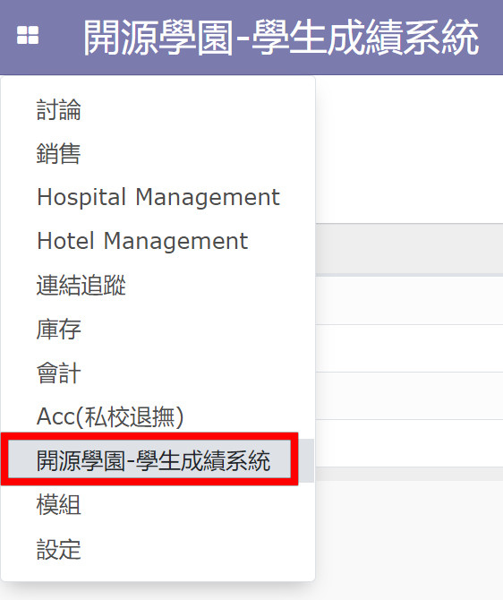

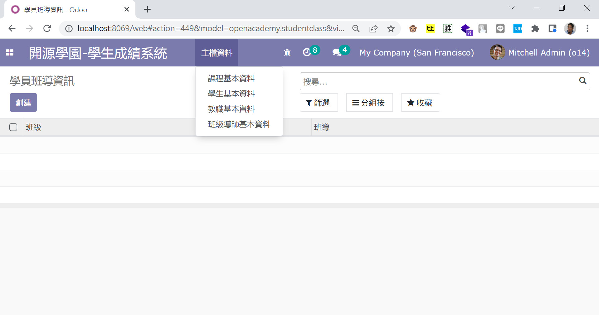

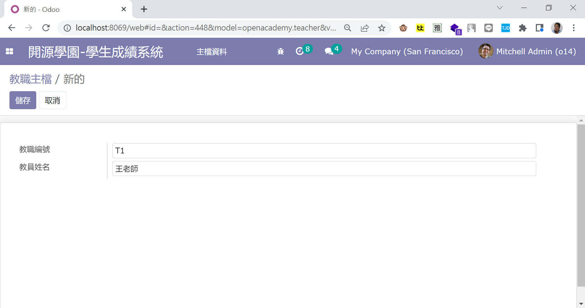

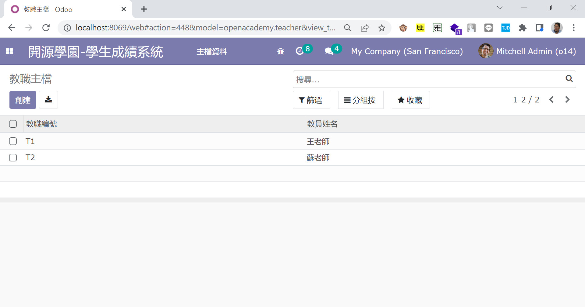


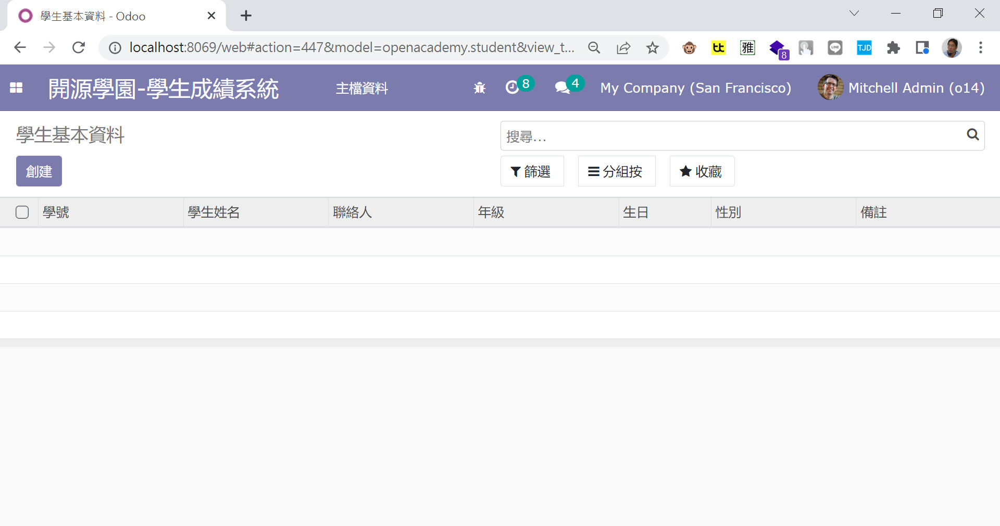

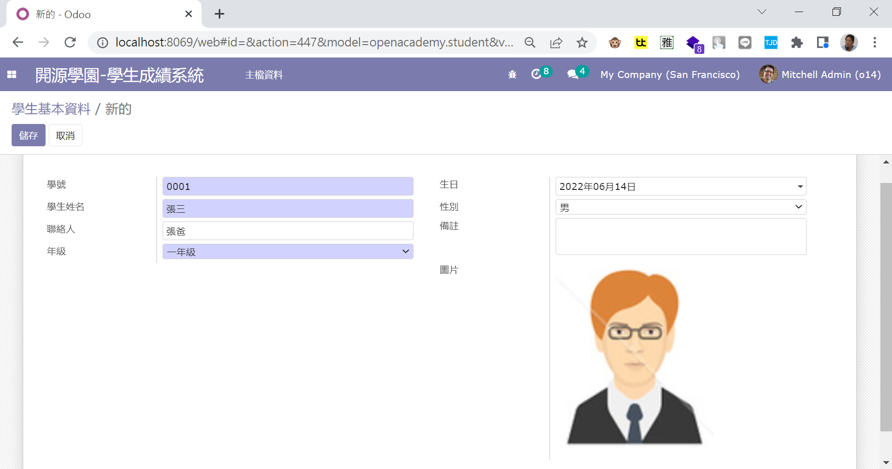

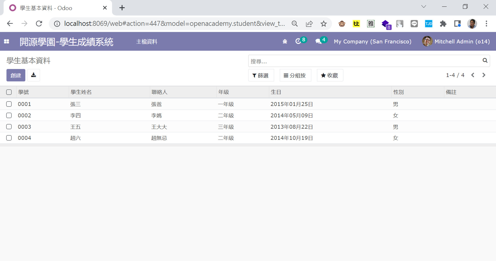

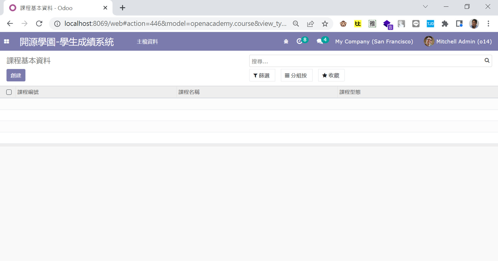

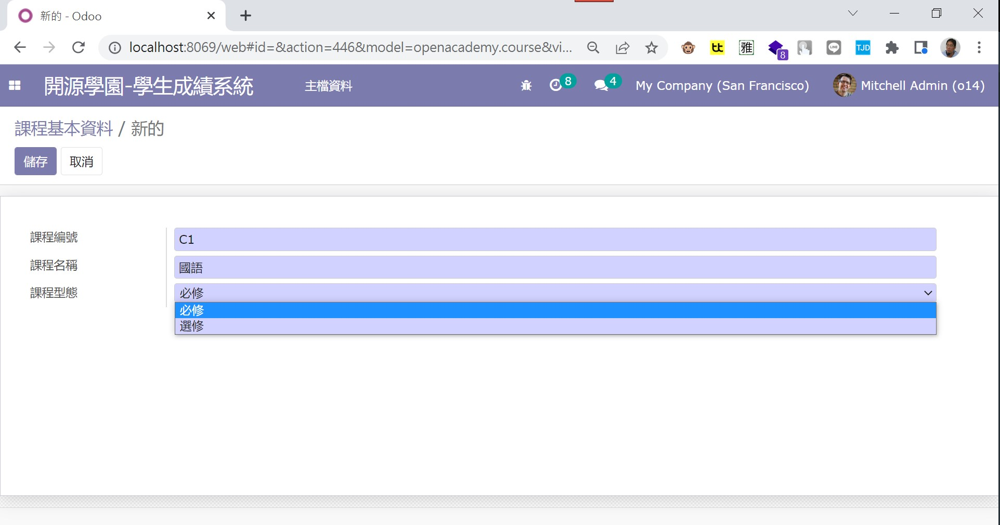

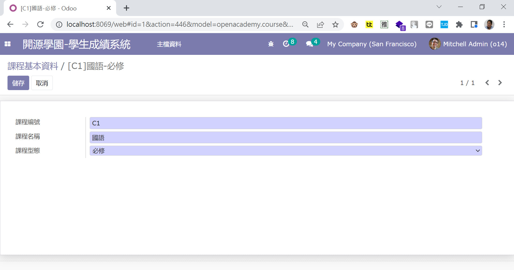

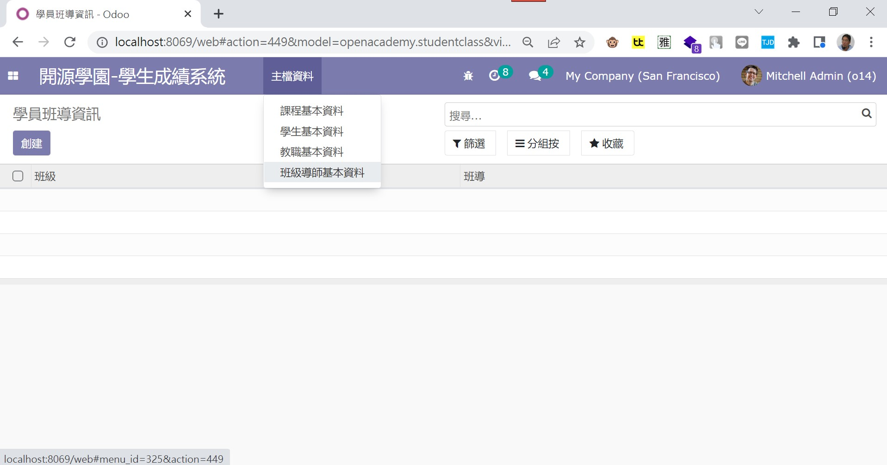

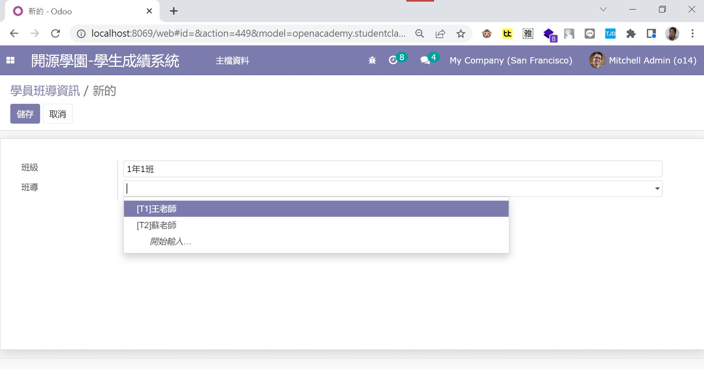

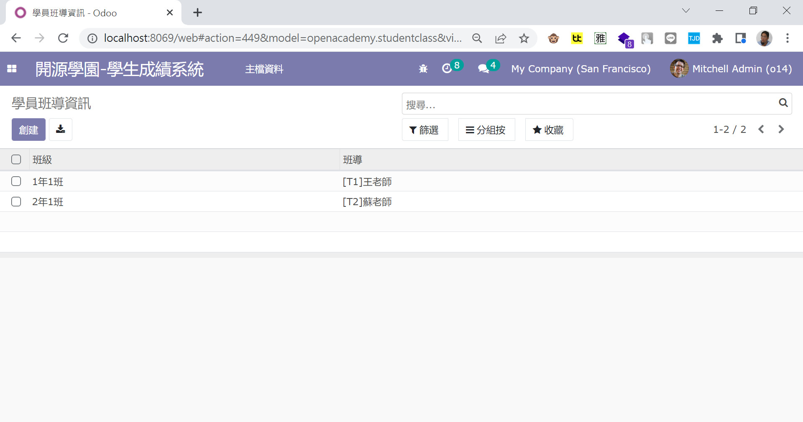

---
=END=